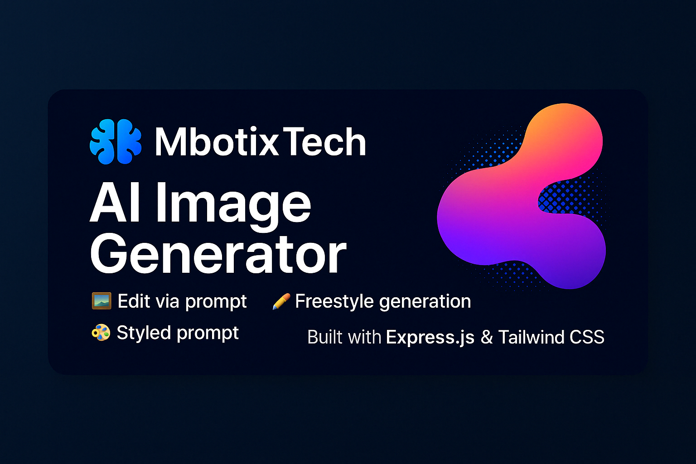

<p align="center">
  
</p>

      

# 🧠 MbotixTech - AI Image Generator

Selamat datang di **MbotixTech AI Image Generator**, sebuah proyek open-source yang memanfaatkan teknologi OpenAI DALL·E 3 untuk menghasilkan gambar AI secara otomatis dari **prompt teks**, **preset gaya visual**, atau bahkan mengedit gambar yang diunggah.

## 🔥 Fitur Utama

- 🖼️ **Edit Gambar + Prompt**  
  Upload gambar dan deskripsikan perubahan yang diinginkan menggunakan teks prompt.

- ✏️ **Prompt Bebas**  
  Hanya masukkan prompt, dan AI akan menghasilkan gambar dari nol.

- 🎨 **Style Prompt**  
  Gunakan preset gaya seperti `cyberpunk`, `realistic`, `cute`, `dark`, dll. Kamu hanya perlu memasukkan topik!

- 🌗 **Dark Mode Toggle**  
  Tampilan visual yang responsif dan aesthetic, mendukung mode terang dan gelap.

- ⚡ **Preview dan Download**  
  Gambar hasil generate dapat dipreview, diunduh, dan disimpan dengan mudah.

## 📦 Teknologi yang Digunakan

- [Node.js](https://nodejs.org/)
- [Express.js](https://expressjs.com/)
- [Tailwind CSS](https://tailwindcss.com/)
- [OpenAI API (DALL·E 3)](https://platform.openai.com/docs/guides/images)
- [Vercel](https://vercel.com/) (Deployment)
- Multer untuk upload gambar

## 🚀 Cara Menjalankan di Lokal

```bash
git clone https://github.com/MbotixTech/ai-image-generator.git
cd ai-image-generator
npm install
npm start
```

## 🌐 Deploy di Vercel

Project ini dioptimalkan untuk Vercel. Pastikan:

- Folder `uploads/` & `temp/` tidak digunakan karena Vercel **read-only** (gunakan penyimpanan lain jika dibutuhkan).
- Gunakan **API-only features** seperti generate prompt tanpa upload gambar jika deploy di serverless.

## ⚙️ File `.env.example` (ganti menjadi .env)

```
OPENAI_API_KEY=sk-xxxxxxxxxxxxxxxxxxxxxxxxxxxxxx
```
## 🛡️ Lisensi

Proyek ini dilisensikan di bawah [MIT License](./LICENSE) - silakan lihat file LICENSE untuk informasi lebih lanjut.

## 🧑‍💻 Author

Created by [**MbotixTech**](https://github.com/MbotixTech)
